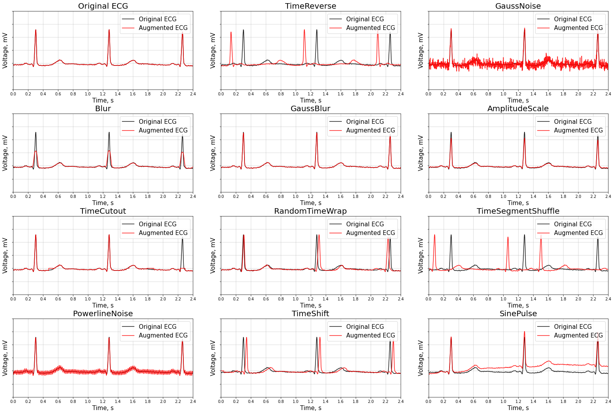

# Ecgmentations

Ecgmentations is a Python library for ecg augmentation. Ecg augmentation is used in deep learning to increase the quality of trained models. The purpose of ecg augmentation is to create new training samples from the existing data.

Here is an example of how you can apply some augmentations from Ecgmentations to create new ecgs from the original one:



## Table of contents
- [Authors](#authors)
- [Installation](#installation)
- [A simple example](#a-simple-example)
- [List of augmentations](#list-of-augmentations)
- [Citing](#citing)

## Authors
[**Rostislav Epifanov** — Researcher in Novosibirsk]()

## Installation
Installation from PyPI:

```
pip install ecgmentations
```

Installation from GitHub:

```
pip install git+https://github.com/rostepifanov/ecgmentations
```

## A simple example
```python
import numpy as np
import ecgmentations as E

# Declare an augmentation pipeline
transform = E.Sequential([
    E.TimeReverse(p=0.5),
    E.ChannelShuffle(p=0.06),
])

# Create example ecg
ecg = np.ones((12, 5000)).T

# Augment an ecg
transformed = transform(ecg=ecg)
transformed_ecg = transformed['ecg']
```

## List of augmentations

The list of all transforms:

- [TimeReverse]()
- [AmplitudeInvert]()
- [ChannelShuffle]()
- [ChannelDropout]()
- [GaussNoise]()
- [Blur]()
- [GaussBlur]()
- [AmplitudeScale]()
- [TimeCutout]()
- [RandomTimeCrop]()
- [RandomTimeWrap]()

## Citing

If you find this library useful for your research, please consider citing:

```
@misc{epifanov2023ecgmentations,
  Author = {Rostislav Epifanov},
  Title = {Ecgmentations},
  Year = {2023},
  Publisher = {GitHub},
  Journal = {GitHub repository},
  Howpublished = {\url{https://github.com/rostepifanov/ecgmentations}}
}
```